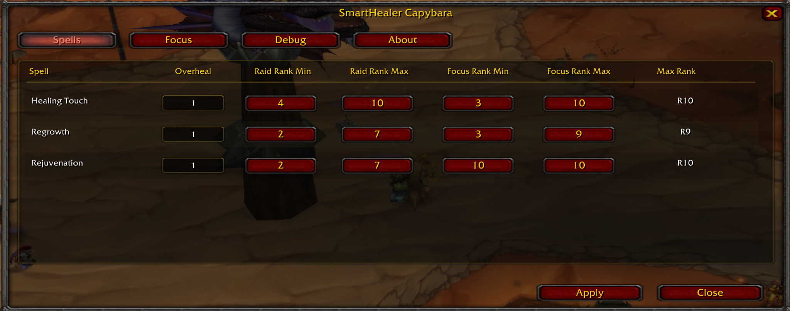

# SmartHealer Capybara

Automatic spell rank selection for healers on **Turtle WoW 1.18.1**.

SmartHealer Capybara is a modern continuation of SmartHealer, updated
for the current Turtle WoW client and the Capybara ecosystem. It
automatically selects the most appropriate spell rank based on missing
health, configurable overheal, and your spell rank limits.

Compatible with:

-   ✅ Capybara Client
-   ✅ Turtle WoW client using the Capybara realmlist

------------------------------------------------------------------------

# Features

-   Automatic spell rank selection
-   Configurable overheal multiplier
-   Per-spell Raid Rank Min/Max
-   Per-spell Focus Rank Min/Max
-   Focus Players list
-   Standard and Verbose debug output
-   Modern configuration interface
-   `/pfcast` compatible
-   HealComm 1.1 included

------------------------------------------------------------------------

# Screenshots

## Overview



------------------------------------------------------------------------

## Spell Configuration

Configure overheal and spell rank ranges for every healing spell.


------------------------------------------------------------------------

## Focus Players

Prioritize tanks, healers, PvP flag carriers, yourself, or any important
player.


------------------------------------------------------------------------

# Installation

1.  Download the latest release.
2.  Extract **SmartHealerCapybara** into:

```{=html}
<!-- -->
```
    Interface/AddOns/

Result:

    Interface
    └── AddOns
        └── SmartHealerCapybara

Restart the game or reload your UI.

------------------------------------------------------------------------

# First Time Setup

Open the configuration:

    /shc config

Configure:

-   Overheal multiplier
-   Raid Rank Min/Max
-   Focus Rank Min/Max
-   Debug mode (optional)

Settings are saved automatically.

------------------------------------------------------------------------

# Focus Players

Players in your Focus list use the **Focus Rank Min/Max** settings
instead of the Raid settings.

Add a player by:

-   Typing their name
-   Or targeting them and leaving the name field empty

Useful for:

-   Yourself
-   Tanks
-   Healers
-   PvP flag carriers
-   Any high-priority player

------------------------------------------------------------------------

# Healing Macros

The addon supports spell-based healing macros.

Example:

    /heal Healing Touch
    /heal Flash Heal
    /heal Lesser Heal
    /heal Chain Heal

The addon automatically selects the appropriate spell rank.

------------------------------------------------------------------------

# Recommended with Puppeteer

SmartHealer Capybara works especially well together with **Puppeteer**.

A typical setup is:

-   Puppeteer handles targeting and healing logic.
-   SmartHealer Capybara selects the optimal spell rank.

This keeps healing efficient while reducing unnecessary overhealing.

------------------------------------------------------------------------

# Compatibility

Designed for:

-   Turtle WoW **1.18.1**
-   Capybara Client
-   Turtle WoW client using the Capybara realmlist

------------------------------------------------------------------------

# Credits

**SmartHealer Capybara**

Maintained by **Zipz**

Based on earlier versions of **SmartHealer** by:

-   Garkin
-   Melbaa
-   dsidirop

------------------------------------------------------------------------

# License

This project is an independent continuation of SmartHealer for the
Turtle WoW 1.18.1 client.

Please credit the original SmartHealer authors when reusing or building
upon this work.
