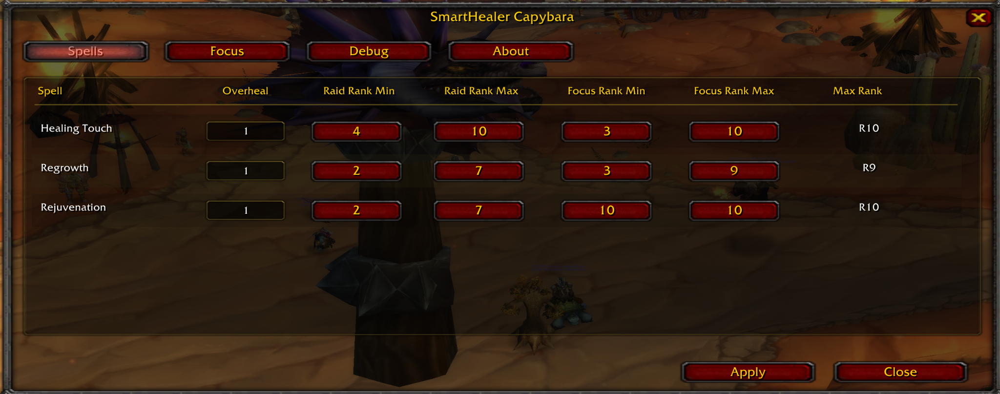
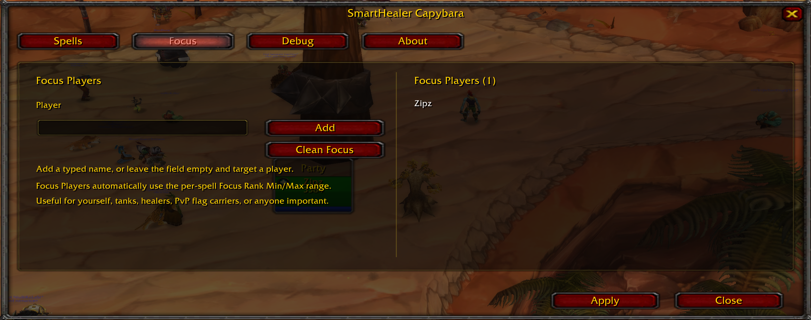

# SmartHealer Capybara

> **Automatic spell rank selection for Turtle WoW 1.18.1 based realms.**

A modern continuation of SmartHealer featuring a redesigned configuration UI, Focus Players and improved spell rank selection.

---

# Features

- Automatic spell rank selection
- Per-spell Raid and Focus rank ranges
- Configurable overheal multiplier
- Focus Players
- Modern configuration UI
---

## Spell Configuration

Configure overheal and spell rank ranges for every healing spell.



---

## Focus Players

Prioritize tanks, healers, PvP flag carriers, yourself, or any important player.



---

# Installation

Extract the addon into:

```text
Interface/AddOns/SmartHealerCapybara
```

Restart the game or reload your UI.

Open the configuration with:

```text
/shc config
```
---

# Usage

Create a macro using the spell you want SmartHealer to manage.

Example:
```text
/heal Healing Touch
```
or
```text
/heal Regrowth
```
SmartHealer automatically selects the appropriate spell rank.

---

# Recommended

SmartHealer Capybara works especially well together with **Puppeteer**.

Puppeteer handles targeting while SmartHealer automatically selects the optimal spell rank.

---

# Credits

**SmartHealer Capybara**

Maintained by **Zipz**

Based on earlier versions of **SmartHealer** by:

- Garkin
- Melbaa
- dsidirop
